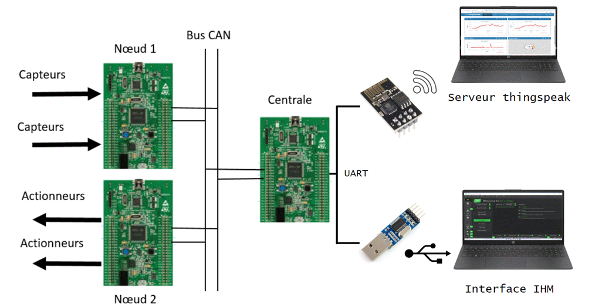

# 🚗 Conception et développement d’un tableau de bord pour une application automobile
Ce projet de fin d’études vise à développer un tableau de bord pour une application automobile,intégrant des capteurs
et actionneurs afin de surveiller et contrôler des paramètres essentiels du véhicule. L’interface utilisateur (IHM)
offre une supervision intuitive et en temps réel, tandis que le système embarqué assure l’acquisition et la transmission 
des données.

# 📌 Objectifs du projet
**.** Concevoir une interface graphique (IHM) moderne pour le suivi des paramètres automobiles

**.** Collecter et transmettre les données via un microcontrôleur STM32F407VGTx

**.** Superviser les grandeurs suivantes :

       - 🌡️ Température du liquide de refroidissement

       - ⚙️ Régime moteur (RPM)

       - ⛽ Niveau de carburant

**.** Assurer une communication locale et distante via Qt et ThingSpeak IoT

**.** Développer un système fiable et modulable, applicable à des environnements industriels et automobiles

# 🖼️ Architecture du système

  

# 🤝 Contribution
Les contributions sont les bienvenues !
N’hésitez pas à ouvrir une issue ou à proposer une pull request pour améliorer le projet.

# 📧 Contact
Pour toute question, suggestion ou collaboration, vous pouvez me contacter via :

Email : baker.essid98@gmail.com

LinkedIn : [Baker Essid](https://www.linkedin.com/in/baker-essid-b27b311b9/overlay/about-this-profile/?lipi=urn%3Ali%3Apage%3Ad_flagship3_profile_view_base%3Bgh8EYV5MTL%2BDU11rWtcMPA%3D%3D)

Je répondrai avec plaisir à vos messages et discussions autour du projet.
